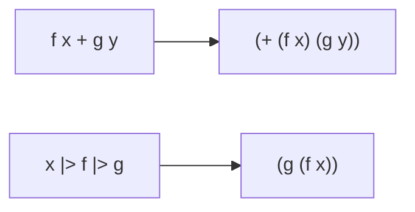
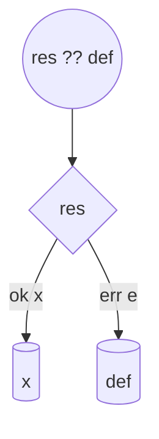
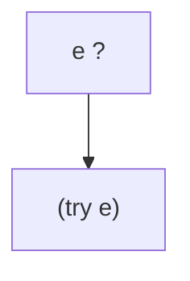
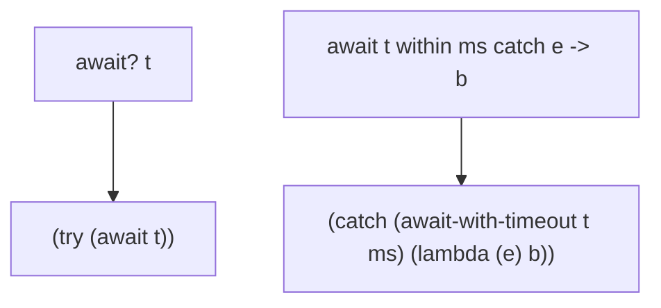
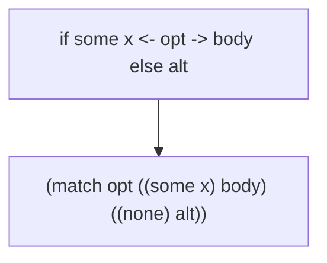
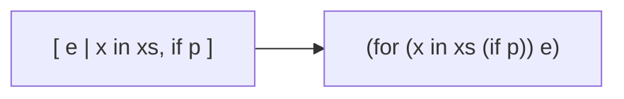
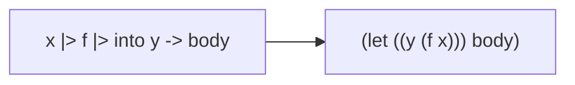

# Diagrams

> Docs status: Unreleased (updated 2025-10-15). See [CHANGELOG](CHANGELOG.md#2025-10-15).

## Evaluation pipeline (all profiles)

```mermaid
flowchart LR
  A[Source text] --> B[Parse (selected profile)]
  B --> C[Desugar to canonical S-expressions]
  C --> D[Macroexpand (hygienic macros)]
  D --> E[Evaluate over S-exprs]
```

## Infix and pipeline desugaring



## Result/Option sugar





## Async × error handling



## Option if-some binding



## Comprehension expansion



## Pipeline into binding



## Record update sugar


